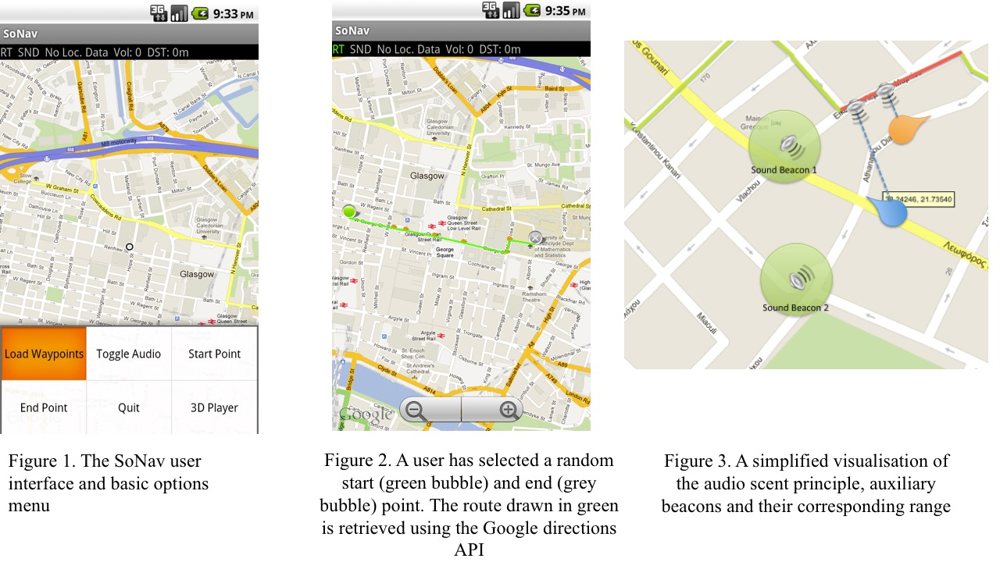

# SoNav
Mobile pedestrian navigation using 3D sound (Android)

To escape the “tyranny” of turn-by-turn navigation instructions, this app considers the concept of audio scent trails to encourage exploration in an urban environment while giving a sense of direction and security. Much like a trail of scent that can be picked up by an animal with enhanced olfactory perception, an audio scent is a trail generated artificially by a navigation system that augments a user’s perceptive experience with continuous (compared to discrete) cues for navigating through the environment. Just as the animal following a scent trail is free to explore different directions of travel in order to pick up the scent and able to return to previous locations where the scent was stronger, a pedestrian following an audio scent is encouraged to explore their surroundings in order to figure out where the audio scent is stronger. However, in contrast to the goal- driven animal, for our pedestrian the exploratory experience is the goal. The freedom to roam about, albeit within the confines of the safety zone within which users can pick up the audio scent, is the distinguishing feature of our concept and its main advantage in improving a visitor’s experience in exploring an urban environment.

We developed a prototype system called SoNav, which can become a promising platform for addressing the issues identified by the preceding survey of the state of the art. SoNav uses 3D spatialised audio on a mobile device to deliver feedback about a user’s position compared to a pre- determined path. Our prototype is built on the Android platform and requires a device with a GPS and magnetic compass sensor. Internet connectivity is desirable, as it allows the UI to display local maps and dynamically compute a route between any chosen start and end points, but is non-essential - as will be shown below. The mode of operation is as follows: The user selects a start and end point from a map-interface on their device. A path between selected points is calculated using the Google directions service and is drawn on the map. Alternatively, a user can load a pre-defined path stored locally on the device. The waypoints of each path are drawn as small orange blobs. Each path is thus divided into appropriate segments, which are later used to determine user distance and azimuth to the path. The user then puts on their headphones, places the phone in their pocket and starts to walk toward their destination and along that path.
As discussed previously, to materialize our concept of an audio scent emanating from the path, we use the following approach: A thread of execution plays back a constant sound (the audio scent) through the user’s headphones, which can be music or a looping Auditory icon. At the moment, we use the sound of a couple of people walking in a city environment, which gives a deeply immersive experience, as if the user is walking with a virtual group. This thread utilizes a port of the OpenAL 3D audio library for Android and thus has the ability to control the sound source distance and orientation during playback. A second thread of execution is responsible for updating the user’s current position using the device location sensors (A/GPS). A final thread monitors the user’s current orientation (magnetic compass). At every orientation update, we calculate the distance of the user to the nearest segment of the path and also the relative azimuth of the user to that of the nearest path segment, using the magnetic north as reference. This information is then passed to the audio player thread, which is responsible for changing the sound source orientation in such a manner so it would seem to the user that the sound is emanating from the direction of the nearest path segment.
As the user places themselves at different angles to the left or right of the path, the sound shifts in 3D around them to indicate the relative position of the path. Additionally, the further away the user is from the path, the lower the sound volume becomes, giving a sense of moving far away from the path, or, in the case of our prototype, to convey a sense of having veered away from the path. Additionally, multiple sound sources can be placed within the soundscape, to act as virtual sound beacons, perhaps marking the location and direction of a point of interest, or the end point of a route.

To better demonstrate our concept, consider the following simple use case: Our pedestrian is placed away from the path in the position marked by the blue marker in Figure 3 and pointing towards the north-west (as indicated by the pointed end of the marker). In this position, the path is to the user’s right at approximately 45 degrees, and as such, the audio balance is shifted mostly (but not fully) towards the right headphone. The user understands that the path they should follow is somewhere to their right, so at the next junction, they take a right turn. As they turn, the sound starts to shift towards their left ear. Given the fact they are now closer to the path, the sound volume becomes higher, indicating their increasing proximity. As the user reaches the position marked by the orange marker, the path is directly to their left, hence the sound shifts to play exclusively in their left headphone.
The user keeps walking until they finally reach the path, in which case the sound equalizes on both ears, as they stand directly on top of the path (actually we do allow a certain radius to account for street and pavement width for this change). Now the user has a choice, whether to turn left or right. Turning left will keep them on the path. A further right turn will gradually take them further away from the path. The sound source will now be behind the user and the sound volume will attenuate as the user walks increasingly further from the path, indicating that they have taken a wrong turn. One might ask, what would have happened if the user had not turned right at the junction after the blue marker but continued straight ahead? This is precisely the point - SoNav leaves the user free to explore an area as they desire, with constant and reassuring feedback given to them at all times, as long as they remain within a certain distance from the path. There is no right or wrong path to follow. The feedback is continuous and there is no need to wait for a turn-by-turn system to recalculate or to issue the next command, which could well not be issued for several hundred meters from the previous one (e.g. walking in a straight line). This means that the user can place their focus on the environment without a need to constantly check a screen or interact with the device for instructions. The user can also choose to wear their headphones occasionally, so as to better focus on the environment or interact with their group. Finally, because we use organic city sounds with intermittent volume peaks (e.g. the sound of a walking person’s heels) and let external sounds filter through, the user is at much less of a danger while navigating than they would be with a constant isolating sound like music.

The project requires use of the OpenAL library port for Android by Martin Pielot (included as a zip file and further info can be found here http://pielot.org/2010/12/openal-on-android/)

If you use this project for your own research, please cite our work as follows:

Komninos, A., Barrie, P., Stefanis, V., & Plessas, A. (2012, September). Urban exploration using audio scents. In Proceedings of the 14th international conference on Human-computer interaction with mobile devices and services (pp. 349-358). ACM.
